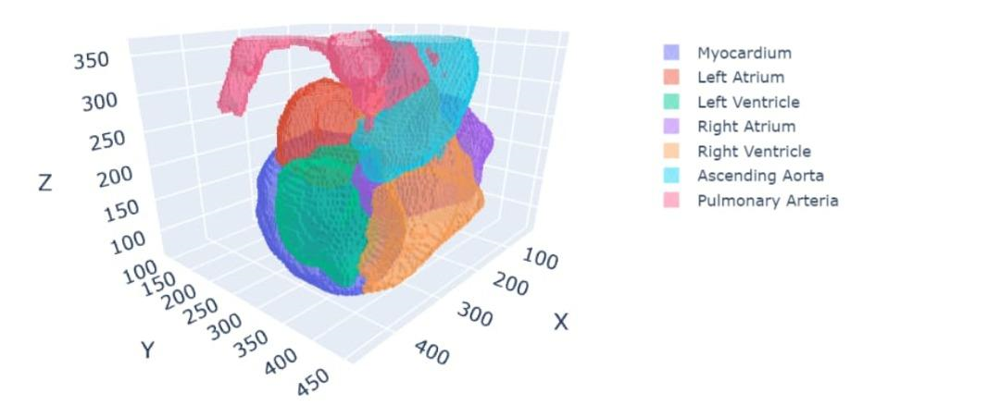

  

# Three-Dimensional Mesh Generation from CT Scan Multisegmentation: A Case Study on the Human Heart

## Step 1: Open the 'data_preprocess' notebook. This notebook helps you create the directory where you can put your data and checks if your data is in the NIFTI format. If it is in DICOM, you can use this notebook for converting the data. Additionally, if your labels need classification, the notebook also helps you map your labels.  
  
## Step 2: Open the 'train' notebook to create a U-Net model and train it with your data.  
  
## Step 3: Open the 'predictions' notebook to make predictions using your trained model. Explore various visualization tools such as diagrams for epoch/loss, epoch/dice, and confusion matrix. Additionally, utilize 2-D sequence plotting and 3-D mesh plots. You also have the opportunity to save your results.
  
## Every script comes with it is own purpose  
  
	- data_setup: contains the functions to prepare the data for the U-Net model  
	- engine: contains all functions to train and predict on a model  
	- plot: contain all functions for plotting the predicted data  
	- u_net: contains the function for creating a U-Net model.  
	- utils: contains function for saving/loading models, metrics etc.  
  
### All functions come with many default Python parameters, allowing you to start immediately without fully understanding every algorithm. As you become more familiar with them, you have the option to adjust the parameters to suit your specific needs.  
  
  
###  Below you will find a documentation.
  
------used Software-----  
`Windows 10/11`  
`Word`  
`Anaconda`  
`VS Code`  
`Notepad++`  
`Jupyter Notebook`  
`Python 3.11.5`  
  
  
------installed libaries----  
`dicom2nifti 2.3.4`  
`mlxtend 0.23.1`  
`MONAI  1.3.0`  
`nibabel 5.2.0`  
`PyTorch  2.1.2`  
`plotly 5.18.0`  
`torchinfo 1.8.0`  
`tqdm 4.66.1`  
`scikit image/skimage 0.20.0`  
		
	
  
  
  
    
------data_setup------  
Show current directory: Path.cwd()
  
Functions:
  
- create_groups: patient_name = returns the path names (file names).
				numberfolders = divides the content of a subdirectory by the variable Number_Slices.
				Note: The path must point to the Train/Test directory, not the subdirectories ('test_data' / 'dicom' / 'images_train').
				Files must be placed in subdirectories beforehand (e.g., "heart_0"), but the function accesses the parent directory ("train").  
- dicom2nifti: Iterates through the patient folders previously created with DICOMs and creates NIFTIs for each folder.  
- find_empty: NIFTIs are loaded using Nibabel.
			 get_fdata = returns a NumPy array with the voxel values of the volume.
			 len(unique) > 2 = counts the unique values and returns True if there are more than two.    
- set_seed: Sets random values for calculations on CPU/GPU.  
- edit_label: This function detects the number of unique values (grayscale values) and maps them to an index in a dictionary.
			 It deletes the original file if a mapped file exists.  
- prepare_train_eval_data:  
			Dictionaries are created using list comprehension and the zip function. The zip function creates an iterator of paired tuples.  
			transforms:  
						- LoadImaged: Loads image file and converts it to a tensor.  
						- Spacingd: pixdim = Scales the size of the voxels and their distance from each other, measured from the voxel center.  
							interpolation = Estimates the arrangement of pixels on the voxels.  
							bilinear (Used for volumes) = Computes/estimates pixel values by calculating the mean of the 4 (2-dimensional space) / 8 (3-dimensional space) nearest points.  
							nearest (Used for segments) = The nearest point/pixel is used to estimate the target point.  
							- Orientationd: Sets a convention with RAS to orient the axes, important for consistent data.  
						- CropForgroundsd: Cuts away all values = 0 up to the edge of the voxels which are > 0.  
						- ScaleIntensityRanged: Manipulates the contrast values.  
							a_min, a_max = Defines original interval ranges of the pixels. Pixel values outside this range are clipped.  
							b_min, b_max = Target interval range in which the pixels should be transformed.  
							clip = If set to True, values outside the target interval are set to b_min or b_max.  
						- Resize: spatial_size: Number of voxels. There is a possibility that Spacingd and Resized may interfere with each other, as Spacingd scales the size of the voxels while Resized changes the number of voxels.   
							- prepare_test_data: Erstellt einen Testdataloader für die prediction.  
							- move_nifti_files: Verschiebt Nifti files von einem gewünschten Verzeichnis in ein gewünschtes Verzeichnis  
							- rescale_predictions: Rescaled die predictions auf die höhen, breiten und tiefen dimension der Originalbilder.    

  
---------U-Net------------  
	Parameters:  
  
    - spatial_dims: Number of image dimensions (3-D image)  
    - in_channels: Input nodes (features)  
    - out_channels: Output nodes (features)  
    - channels: Number of features to be stacked in each layer stack  
    - strides: Size of the convolutional layer steps  
    - num_res_units: Layer stacks with shortcut connections, practical because they don't need to backpropagate through every layer (useful for networks with many layers -> Deep Nets)  
    - norm: Type of normalization between the layers. In this case, batch normalization is applied to the activation values before they enter the activation function.  
    - Torchinfo summary embedded to provide the user with a better visualization of the model.  
  
--------engine-------------    
	 Functions:  
  
    - dice_metric: Computes a metric to measure the accuracy of the model.  
    - Squared_pred: If True, logits or predictions are squared to amplify the differences between predictions and labels.  
    - The dice_value is subtracted from 1 to create a metric where 1 is the best possible result.  
    - train_step: Returns train loss and train metric.  
    - test_step: Returns test loss and test metric.  
    - train: Returns all metrics.  
    - calculate weights (only for cross-entropy loss): Computes the weighting for the loss function based on the relative frequency of the class. Intended to balance potential class imbalances in the data.  
    - perform_inference: Function that returns a prediction dataset.  
    - create_prediction_list: Creates a list with predictions and a list with labels.  
  
---------utils-------------  
	Functions:  
  
	- save_model: Takes the model and a target directory as parameters.  
	- Assert statement is provided to ensure proper file extension of the model. If neither .pth nor .pt extension is used, an exception is raised, indicating the error with a message.  
	- If the target directory is not found, it is created.  
	- load_weights: Takes the model and the directory where the weights are stored as parameters.  
	- Returns feedback whether the model is None or not.  
	- save_metric: Saves the average loss and the average dice metric in respective numpy files.  
	- save_best_metric: Saves the best metric as a text file. Used in the model to compare the current metric with the best metric.  
	- If the current metric is more accurate, it replaces the best metric and the model is saved.  
	- save_best_metric_info: Saves the best metric with the best epoch and timestamp in a text file.  
	- load_best_metric: Loads the best metric.  
	- create_writer: Writes the loss and dice metrics to a directory, can be visualized with Tensorboard.  
	- save_nifti: Takes a list of predictions (previously only accepted a tensor) -> Prediction is saved in a Nifti file.  
	- number_of_classes: Returns the number of classes.  
	- remove_directory_recursive: Deletes a directory with all its data.  
		
----------plot------------  
	Functions:  
  
    - generate_mesh: Generates a mesh based on the rescaled predictions.  
    - plot_mesh: Vertices are coordinate points in space that define the corners of triangles. A vertex consists of a number of vertices.  
    - each vertex contains the coordinates (x, y, z) of a point in space.  
    - Faces define the connection between vertices to form a surface or polygon.  
    - plot_confusion_matrix: Creates a confusion matrix that compares the labels and the predictions.  
    - plot_image_label_prediction: Plots a selected dataset (image, label, binary prediction, multi-prediction) using Matplotlib.  
    - plot_metric: Creates a matplotlib diagram for the metrics: train/test loss and train/test metric.  
  
	
---------Tensorboard Tutorial--------  
	To run TensorBoard, you need to enter the following command in the command line: tensorboard --logdir ..\runs  
	To display TensorBoard in the browser, you need to enter this local address: localhost:6007  

------------------------------------------------------------  
	Folder Structure: The images and their corresponding labels must be saved in folders with the same name (e.g., heart_01).  
  
  
------------------------------------------------------------  
	Annotations: To increase code readability, I have provided all parameters, return values, and variables with data type annotations.
